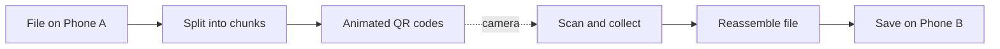
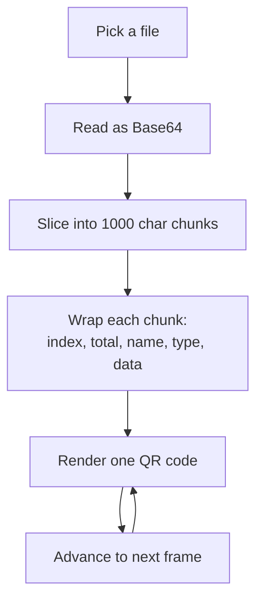
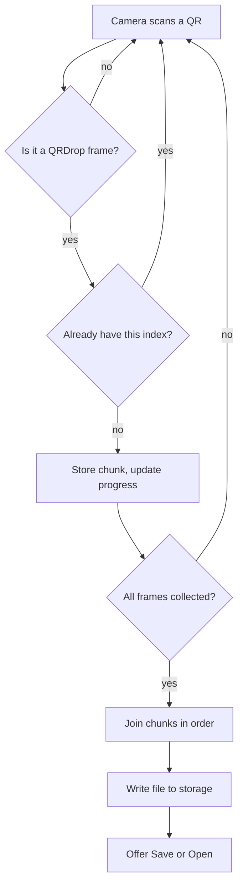

# QRDrop: sending files between phones with light

*A bytebuild write-up: what it is, why it exists, and how it works.*

## Why it was built

Sharing a file between two phones usually means the cloud. You upload to a server, the other person downloads, and a copy of your file now lives on someone else's computer. That needs internet, an account, and trust.

QRDrop removes all three. Two phones sit near each other. One shows a stream of QR codes, the other watches through its camera, and the file crosses the gap as light. No backend, no internet, no server. The data only ever touches your two devices.

This helps in the places sharing usually breaks: no signal, no data bundle, a locked-down device, or a file you simply do not want on a stranger's cloud.

## The idea in one picture

The screen is the transmitter. The camera is the receiver. The animation is the wire.

## The stack

- **Expo + React Native** for one codebase on Android and iOS.
- **expo-camera** to scan QR codes.
- **expo-document-picker** to choose a file.
- **expo-file-system** (SDK 57 File API) to read and write bytes.
- **react-native-qrcode-svg** to draw each frame.
- **expo-sharing** and the storage picker to hand the file off at the end.

## How the sender works

A file is not one QR code. A single QR code holds only a few kilobytes, so the file is read as Base64 text and sliced into fixed pieces. Each piece becomes one frame, wrapped with just enough context to stand on its own: its position, the total count, and the file name and type.

The frames loop forever at a chosen speed. Looping is deliberate. It means the receiver can start late, glance away, or restart, and still catch every frame on the next pass. The sender never needs to know if anyone is watching.

## How the receiver works

The camera reads whatever QR codes enter its view. Each scan is parsed, checked, and stored by its index. Duplicates are ignored, so a frame seen three times still counts once. When every index is present, the file is whole.

Because each frame carries the total count, the receiver knows how many pieces to expect from the very first scan it decodes. Progress is honest from the start: "9 of 14 frames received."

## The one number that controls speed

Throughput comes down to a simple product:

**speed = frames per second × bytes per frame × scan success rate**

Push frames per second too high and the camera cannot decode each one, so misses climb. Make each QR too dense and it needs a steadier hand. QRDrop keeps chunks at 1000 characters with a light error-correction level, uses short one-letter keys in each frame so almost none of the QR is wasted on labels, and lets the sender pick 2, 5, or 8 frames per second. The sweet spot lands where the receiver decodes cleanly and the loop rarely repeats.

## What it took to get right

- **QR capacity math.** Chunk size and error correction were tuned so each code is dense enough to be quick but still readable at arm's length.
- **Resilience over handshakes.** There is no pairing step and no acknowledgement. The looping stream plus duplicate skipping does the same job with none of the fragility.
- **Reading picked files.** Modern file APIs are permission scoped, so QRDrop reads through the app sandbox first and falls back to the system when a picked file arrives as a shared reference.
- **A real save.** Received files go through the device folder picker, so they land where you choose, not just into a share sheet.

## The takeaway

QRDrop is a reminder that "no internet" is a feature, not a limitation. With a screen, a camera, and a bit of framing logic, two phones can trade files in the open air, privately, and on their own terms.
